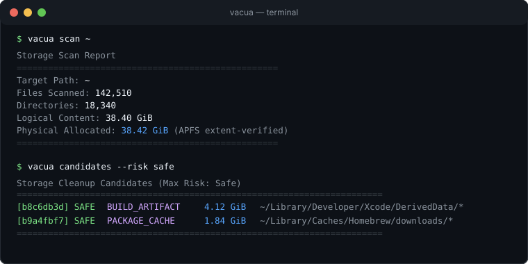
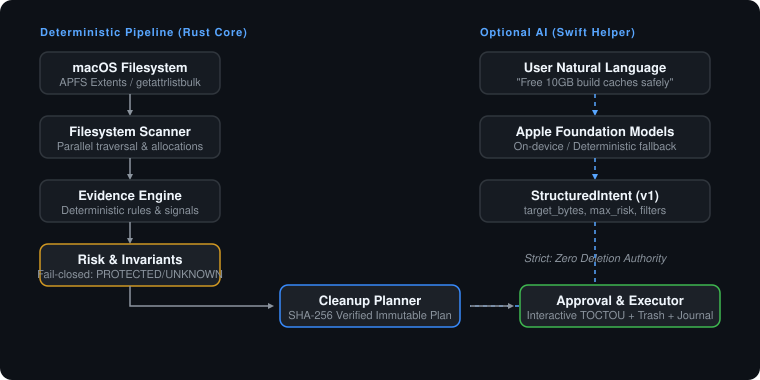

<p align="center">
  <picture>
    <source media="(prefers-color-scheme: dark)" srcset="assets/brand/vacua-mark-dark.svg">
    
  </picture>
</p>

<h1 align="center">Vacua</h1>

<p align="center">
  <strong>Storage intelligence for macOS.</strong><br>
  Understand what consumes space. Know what is safe to reclaim. Clean only with evidence.
</p>

<p align="center">
  <a href="https://github.com/yuanweize/vacua/actions/workflows/ci.yml"></a>
  <a href="https://github.com/yuanweize/vacua/releases"></a>
  <a href="https://github.com/yuanweize/homebrew-tap"></a>
  <a href="LICENSE-MIT"></a>
  
</p>

---

## Quick Install

### Homebrew (Recommended)

```bash
brew install yuanweize/tap/vacua
```

Verify your installation:

```bash
vacua --version
vacua doctor
```

*(For manual tarball downloads or building from source, see [Installation Options](#installation-options).)*

---

## 30-Second Demo

```bash
# 1. Capture a baseline storage snapshot
$ vacua snapshot create ~ --name monday

# ... develop / compile / browse ...

# 2. Compare storage growth differential against baseline
$ vacua diff monday current

# 3. Ask natural language questions grounded in evidence
$ vacua ask "Why did my storage grow?"

# 4. Simulate consequences (freeable space, rebuild costs) before cleaning
$ vacua plan ~ --simulate

# 5. Verify cryptographic integrity of execution history
$ vacua history verify
```

<p align="center">
  
</p>

---

## Engineering Highlights

Vacua is an evidence-first storage intelligence engine for macOS designed to reason about ownership, growth, physical block allocation, and rebuild costs before modification:

- **APFS Clone-Aware Allocation Accounting**: Uses Darwin `getattrlist(FSOPT_ATTR_CMN_EXTENDED)` to query kernel clone attributes (`ATTR_CMNEXT_CLONEID | ATTR_CMNEXT_EXT_FLAGS | ATTR_CMNEXT_CLONE_REFCNT`). Distinguishes physical shared clone space from exclusive blocks with conservative reclaim bounds, preventing copy-on-write files from inflating freeable estimates. Verified by [`clonefile(2)` integration tests](crates/vacua-scan/src/scanner.rs).
- **Staged BLAKE3 Content Identity & Persistent Fingerprint Cache**: 6-stage pipeline (Size buckets -> Hardlink collapse -> APFS clone classification -> Domain-separated 3-window sample hash -> Bounded sequential BLAKE3 -> Stage 6 Destructive Pair Confirmation). Bypasses up to 100% of I/O on unique files and caches versioned digests in SQLite keyed by nanosecond filesystem identity (`mtime_nsec`, `ctime_nsec`).
- **APFS Physical-Sharing Duplicate Accounting**: Strict distinction between hardlinks (0 bytes reclaimable), APFS copy-on-write clone families (shared physical extents, conservative lower/estimated bounds), and independent physical copies. Prevents inflated reclaim estimates.
- **TOCTOU & Cloud Dataless Safety**: Open file descriptor dual `fstat` validation before and after streaming hash (invalidation on `ChangedDuringRead`). Automatic detection of Darwin `SF_DATALESS | UF_DATALESS` flags to prevent downloading iCloud/cloud placeholders.
- **Streaming & Bounded Concurrent Scanner**: Multi-threaded parallel metadata worker pool utilizing bounded `sync_channel(2048)` backpressure and deterministic path-order collation. Achieves >300,000 files/sec with <47 MB peak RSS on 100k nodes. Verified via [calibrated benchmarks](BENCHMARKS.md).
- **Persistent Incremental Indexing via Darwin FSEvents**: Native CoreServices `FSEventStreamCreate` stream with persistent SQLite event cursors (`watched_roots`), updating dirty subtrees surgically without traversing untouched directories. Verified by [FSEvents integration and equivalence tests](crates/vacua-index/src/fsevents.rs).
- **Point-in-Time Snapshots & Recursive Subtree Diff**: Capture historical allocation state with recursive directory rollup and diff space deltas over time (`vacua snapshot create`, `vacua diff baseline current`).
- **Application Evidence Graph & Orphan Detection**: Multi-signal orphan analysis tracing bundles, receipts, LaunchAgents/Daemons, Containers, Preferences, Caches, Saved State, and active processes (`vacua apps / leftovers`).
- **Reclaim Cost Model & What-If Simulation**: Deterministically models rebuild friction, active git projects, and network redownload bounds before cleanup (`vacua plan --simulate`).
- **Grounded Storage Reasoning Engine (`vacua ask`)**: Natural language query engine grounded strictly in snapshot diffs, candidate evidence vectors, and Reclaim Cost, validated against hallucinated references with zero execution authority.
- **Verifiable Execution & Cryptographic Hash Chaining**: Moves items via native macOS Trash (`-[NSFileManager trashItemAtURL:resultingItemURL:error:]`), enforces fail-safe pre-action intent journaling (aborts immediately if audit write fails), and links all execution records into a hash-chained integrity verification log (`vacua history verify`).
- **Bounded On-Device Apple Intelligence**: Direct query of Apple `SystemLanguageModel.default.availability` with real typed `@Generable` guided generation and strictly truthful provenance (`provider_used = "apple-system"` only on real neural inference; zero deletion authority).

---

## Duplicate Intelligence

Discover exact byte-identical duplicates without blind full-disk hashing, while respecting APFS copy-on-write sharing and hardlinks:

```bash
$ vacua duplicates ~ --min-size 10M
```

*(Example illustrative output)*:
```text
Exact duplicate groups:        14
Logical duplicate bytes:       38.2 GB
Confirmed reclaimable:         12.8 GB
Estimated reclaimable:         15.1 GB
APFS shared / clone extents:   18.3 GB
```

### Core Identity Principles
- **Logical duplicates != Physical reclaimability**: Hardlinks sharing the same inode reclaim **0 bytes** unless the last link is deleted. APFS clones share copy-on-write physical extents; deleting one copy frees only its exclusive private extents. Vacua reports confirmed lower bounds alongside logical duplication.
- **Sample hashes filter; Full BLAKE3 proves**: Deterministic 3-window sampling quickly rejects same-size non-duplicates, but exact duplicates are never declared without full cryptographic BLAKE3 verification.
- **Duplicate evidence is not deletion authority**: User documents are classified under `REVIEW` or `PROTECTED`. Cleaning requires explicit review (`vacua duplicates show <group-id>`) and compilation of an immutable, verified cleanup plan (`vacua duplicates plan <group-id> --keep <member>`). Zero direct deletion path exists.

---

## Why Vacua?

Most cleanup utilities for macOS are either simplistic shell wrappers (`rm -rf ~/Library/Caches`) or closed-source commercial applications offering opaque "Scan & Clean" buttons.

Vacua is engineered around a core tenet: **Understand storage before modifying storage.**

- **APFS Clone-Aware Reclaim Accounting**: Distinguishes logical file size from actual physical blocks (`st_blocks * 512`), properly accounting for copy-on-write clone references, hardlink sharing, and kernel private sizes (`ATTR_CMNEXT_PRIVATESIZE`) on supported APFS volumes.
- **Evidence-First Classification**: Every candidate is linked to an evidence vector detailing matched rules, active process guards, reconstructability ratings, and rebuild consequences.
- **Fail-Closed Safety Invariants**: `PROTECTED` locations (`/System`, `~/.ssh`, `~/.gnupg`, `~/Library/Keychains`, `.git/`) and `UNKNOWN` files are unconditionally blocked from automated cleaning.
- **TOCTOU Mitigated Execution**: Safely opens regular files via `O_NOFOLLOW | O_NONBLOCK`, re-validates live device ID, inode, regular file type, size, nanosecond mtime/ctime, and cryptographic BLAKE3 content digest immediately before moving to Trash. If a file changed since plan compilation, execution is aborted.
- **Native macOS Trash**: Approved actions invoke native macOS `-[NSFileManager trashItemAtURL:resultingItemURL:error:]` across volumes, preserving the ability to restore files via Finder.
- **Hash-Chained Audit Journal**: Every execution records a local SQLite audit transaction forming an unbroken SHA-256 hash chain verified via `vacua history verify`. *(Note: without a separately protected signing key, the chain detects unsynchronized modifications and broken links rather than preventing complete history rewrites by an attacker with direct database write access).*

---

## How It Works

```
Filesystem (APFS) ──► Scanner ──► Evidence Engine ──► Risk Engine
                                                            │
User NL Query ─────► Apple Intelligence ──► StructuredIntent ┼──► Immutable Plan ──► User Approval ──► Safe Executor
                                                            │
                                             (Zero Deletion Authority)
```

<p align="center">
  
</p>

- **Deterministic Core (Rust)**: Handles bounded filesystem traversal, physical block analysis, rule evaluation, plan compilation, TOCTOU safety guards, and SQLite journaling.
- **Optional Native Intelligence (Swift)**: An isolated helper (`vacua-intelligence`) bridging Apple Foundation Models for natural language queries.

---

## Safety Invariants

Vacua enforces hard compile-time and runtime safety rules:

1. **Read-only by default**: `scan`, `candidates`, `explain`, and `plan` never mutate the filesystem.
2. **Unknown data is never auto-cleaned**: Unrecognized items are classified as `UNKNOWN` and can never be marked as `SAFE`.
3. **AI cannot lower risk or execute deletions**: LLM outputs are treated as untrusted user suggestions and cannot bypass policy invariants.
4. **Destructive actions require a verified plan and explicit user approval**: No arbitrary `rm` command exists in Vacua. Execution requires an immutable, hash-verified plan file.

For the formal safety proof and threat model, see [SAFETY.md](SAFETY.md) and [docs/THREAT_MODEL.md](docs/THREAT_MODEL.md).

---

## Apple Intelligence Status

Vacua features an optional native Swift helper that bridges Apple Foundation Models on supported Apple Silicon Macs running macOS Sequoia or newer.

```text
Optional on-device intent translation using Apple Foundation Models.
Vacua's safety decisions never depend on an LLM.
When Apple's model is unavailable, Vacua automatically falls back to deterministic intent parsing.
```

Probing system model availability:
```bash
$ vacua intelligence status
```

Testing natural language query parsing:
```bash
$ vacua intelligence parse "free 10GB of build caches safely"
```

```
Apple Intelligence Status
──────────────────────────────────────────────────
Provider Requested: Apple On-Device (Foundation Models)
Provider Used:      deterministic-fallback (or apple-on-device)
Model Availability: modelNotReady (or available)
Network Egress:     No (Strict on-device inference)
Role:               Intent translation (NL -> StructuredIntent)
Execution:          Forbidden (Zero deletion authority)
──────────────────────────────────────────────────
```

---

## Feature Matrix

| Capability | Engine | Mode | Status |
| :--- | :--- | :--- | :--- |
| **Filesystem Scanning** | Rust | Offline / Deterministic | Shipped (v0.1.0) |
| **APFS Extent Accounting** | Rust | Offline / Deterministic | Shipped (v0.1.0) |
| **Evidence & Risk Engine** | Rust | Offline / Deterministic | Shipped (v0.1.0) |
| **Immutable Cleanup Planner** | Rust | Offline / Deterministic | Shipped (v0.1.0) |
| **TOCTOU Safe Executor** | Rust | Offline / Reversible Trash | Shipped (v0.1.0) |
| **SQLite Transaction Journal** | Rust | Offline / Local Audit | Shipped (v0.1.0) |
| **Apple Intent Translation** | Swift | Optional On-Device / Fallback | Shipped (v0.1.0) |
| **Cloud AI / Telemetry** | None | Disabled / Zero Network Egress | Never / Excluded |
| **Read-Only MCP Server** | Specification | JSON v1 supported | Planned (Phase 4) |
| **Native SwiftUI GUI** | Swift | Desktop Interface | Planned (Phase 5) |

---

## CLI Reference

| Command | Description |
| :--- | :--- |
| `vacua scan <path> [-j N] [--incremental]` | Stream filesystem metadata with APFS clone accounting and bounded concurrency |
| `vacua index status` | Inspect persistent SQLite metadata index stats and watched FSEvents roots |
| `vacua index refresh <path>` | Surgically refresh dirty subtrees via native macOS `FSEventStream` replay |
| `vacua snapshot create <path> --name <name>` | Record an immutable point-in-time storage allocation snapshot |
| `vacua snapshot list` | List historical point-in-time snapshots and indexed sizes |
| `vacua diff <base> [target]` | Differential comparison of storage allocation deltas (or live `current`) |
| `vacua apps [show <bundle_id>]` | Inspect installed application bundles and associated filesystem residue |
| `vacua leftovers` | Detect uninstalled application residue with high orphan confidence |
| `vacua ask "<query>"` | Evidence-grounded natural language storage reasoning query engine |
| `vacua candidates <path>` | List classified cleanup candidates (`--risk safe\|review\|caution`) |
| `vacua explain <id>` | Inspect detailed evidence vector and rebuild effects for a candidate |
| `vacua plan <path> [--simulate]` | Compile immutable cleanup plan or simulate consequences without modifying disk |
| `vacua execute <plan> [--dry-run]`| Safely execute an approved cleanup plan with live TOCTOU guards via native Trash |
| `vacua history [show <tx_id>]` | View past cleanup transactions and itemized audit records |
| `vacua history verify` | Verify cryptographic SHA-256 hash chain integrity of the audit journal |
| `vacua doctor` | Diagnose storage pressure, APFS health, and permissions |
| `vacua completions <shell>` | Generate shell completions (`zsh`, `bash`, `fish`) |
| `vacua intelligence status` | Check Apple Foundation Models availability and IPC state |
| `vacua intelligence parse "<prompt>"` | Translate a natural language query into a structured intent |

---

## Installation Options

### 1. Homebrew Tap (Recommended)
```bash
brew install yuanweize/tap/vacua
```

### 2. Standalone Release Tarball
Download the pre-compiled binary package from [GitHub Releases](https://github.com/yuanweize/vacua/releases):

```bash
# Verify checksum
shasum -a 256 vacua-v0.4.1-aarch64-apple-darwin.tar.gz

# Extract and install
tar -xzf vacua-v0.4.1-aarch64-apple-darwin.tar.gz
cd vacua-v0.4.1-aarch64-apple-darwin
sudo cp bin/vacua bin/vacua-intelligence /usr/local/bin/
```

### 3. Build from Source
Requirements: macOS 14+, Rust 1.80+, Swift 6.0+, Xcode Command Line Tools.

```bash
git clone https://github.com/yuanweize/vacua.git
cd vacua

# Build Rust CLI
cargo build --release --bin vacua

# Build Swift Intelligence Helper
(cd apple/VacuaIntelligence && swift build -c release)

# Sibling discovery: place binaries together
cp apple/VacuaIntelligence/.build/release/vacua-intelligence target/release/
./target/release/vacua --version
```

---

## Documentation

- [Calibrated Performance Benchmarks](BENCHMARKS.md)
- [Architecture & Design Decisions](ARCHITECTURE.md)
- [Safety Model & Invariant Enforcements](SAFETY.md)
- [Frequently Asked Questions (FAQ)](docs/FAQ.md)
- [Threat Model & Attack Vector Analysis](docs/THREAT_MODEL.md)
- [Brand Identity & Design Guidelines](assets/brand/BRANDING.md)
- [Uninstallation Guide](docs/UNINSTALL.md)
- [Rule Format Specification](docs/RULE_FORMAT.md)
- [Intelligence Bridge Architecture](docs/INTELLIGENCE.md)
- [Feature Reality Matrix](FEATURE_REALITY_MATRIX.md)
- [Contributing Guidelines](CONTRIBUTING.md)

---

## License

Dual-licensed under either:
- **MIT License** ([LICENSE-MIT](LICENSE-MIT))
- **Apache License, Version 2.0** ([LICENSE-APACHE](LICENSE-APACHE))

at your option.
