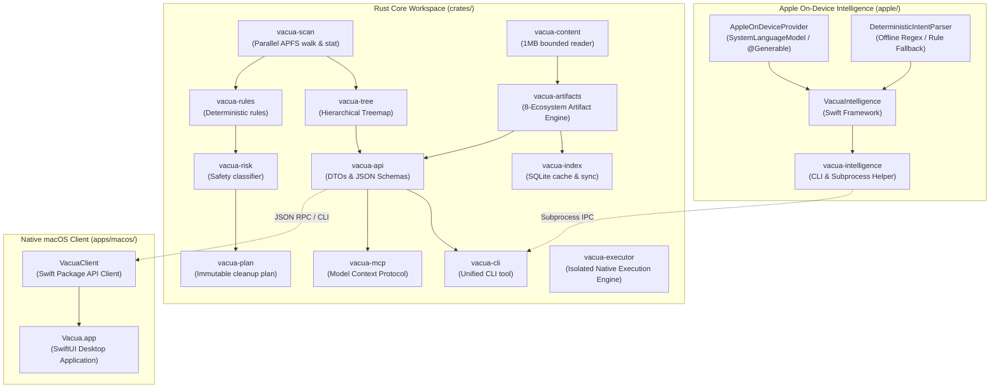

# Vacua: Apple Intelligence Cross-Workstation Handoff Document

> **Status**: FORMAL ENGINEERING HANDOFF  
> **Source Workstation Release**: `v0.8.0`  
> **Release Target Git SHA**: `7e9ae7159eb20f6f49e0031efe1cd101c0fb5941`  
> **Project License**: Canonical `Apache-2.0` (Unified across all crates, apps, and distribution formulas)  
> **Next Recommended Milestone**: `v0.9 — Apple Foundation Models Runtime & Grounded Intelligence`

---

## 1. Project Mission

Vacua is an explainable, safety-first storage intelligence system for macOS, built from first principles for APFS.  
It replaces opaque disk-cleaners with transparent, evidence-backed insight into disk consumption, specializing in:
1. **APFS-Native Precision**: Distinguishing logical byte size from physically allocated blocks, handling clones, hardlinks, purgeable space, and dataless cloud placeholders without forced hydration.
2. **Deterministic Evidence Model**: Classifying filesystem entries based on immutable evidence (manifests, lockfiles, git status, modification timestamps) rather than directory naming heuristics.
3. **Strict Execution Decoupling**: Operating under an `analyze / explain / propose only` safety contract. Neither the CLI, the MCP server, nor the native macOS app performs destructive deletions by default.

---

## 2. Current Public Release Identity

- **Version**: `0.8.0`
- **Release Tag**: `v0.8.0` (Dereferences strictly to `7e9ae7159eb20f6f49e0031efe1cd101c0fb5941`)
- **Release Commit**: `7e9ae7159eb20f6f49e0031efe1cd101c0fb5941`
- **Cryptographic Digests (Live Verified)**:
  - CLI Tarball (`vacua-v0.8.0-aarch64-apple-darwin.tar.gz`):  
    `077f7137c1119e7928d4f2e1f711f10331a3babd065cf9f25d1b0b451b353aea`
  - macOS App Zip (`Vacua-v0.8.0-macos-arm64-unsigned.zip`):  
    `9046c4ad7d6f8a93e484dd105af8d9bc80b3676f7ac4da078ca0da3fd286d584`
- **Build Provenance**: Verified with Sigstore/SLSA v1 via `gh attestation verify`.
- **Homebrew Formula**: Upgraded and tested in `yuanweize/homebrew-tap/Formula/vacua.rb`.

---

## 3. Subsystem Architecture Map



### Component Directory & Responsibilities

| Subsystem / Crate | Directory | Language | Core Responsibility |
| :--- | :--- | :--- | :--- |
| `vacua-scan` | `crates/vacua-scan` | Rust | Fast, multi-threaded APFS scanner respecting mount boundaries and APFS block flags. |
| `vacua-content` | `crates/vacua-content` | Rust | Safe, bounded file content inspector (strictly capped at 1 MiB to prevent memory exhaustion). |
| `vacua-rules` | `crates/vacua-rules` | Rust | Deterministic heuristic rules detecting system caches, Xcode DerivedData, build artifacts, etc. |
| `vacua-risk` | `crates/vacua-risk` | Rust | Multi-tiered safety and reclaim risk categorizer (Protected, System, Work, Ephemeral). |
| `vacua-plan` | `crates/vacua-plan` | Rust | Cryptographically hashed, immutable cleanup proposals with blast radius estimates. |
| `vacua-tree` | `crates/vacua-tree` | Rust | Hierarchical storage tree generator supporting delta comparisons and bounded treemap generation. |
| `vacua-index` | `crates/vacua-index` | Rust | Local SQLite state cache managing persistent scans, project identities, and artifact snapshots. |
| `vacua-artifacts`| `crates/vacua-artifacts`| Rust | 8-ecosystem developer artifact engine (Cargo, SwiftPM, Xcode, Node, Python, Gradle, Maven, CMake). |
| `vacua-api` | `crates/vacua-api` | Rust | Canonical JSON Schemas and serializable DTOs bridging Rust to Swift and MCP. |
| `vacua-mcp` | `crates/vacua-mcp` | Rust | Model Context Protocol server exposing read-only storage and artifact tools to AI assistants. |
| `vacua-cli` | `crates/vacua-cli` | Rust | Primary binary providing commands: `scan`, `tree`, `artifacts`, `intelligence`, `doctor`, `index`. |
| `vacua-executor` | `crates/vacua-executor`| Rust | Air-gapped, human-only execution engine using macOS native Trash APIs. Isolated from MCP and AI. |
| `VacuaClient` | `apps/macos/Packages/VacuaClient` | Swift | Typed Swift client parsing `vacua` JSON outputs into Swift models. |
| `Vacua.app` | `apps/macos/Vacua` | Swift | Native macOS SwiftUI application with sidebar, interactive Treemap, and Developer Artifacts Center. |
| `VacuaIntelligence` | `apple/VacuaIntelligence` | Swift | FoundationModels provider with guided `@Generable` structured generation and fallback parsers. |

---

## 4. Security Boundaries & Invariants

The following security boundaries are permanently enforced and must **never** be compromised:

1. **No Destructive GUI Actions**:  
   The Developer Artifacts Center and Storage Treemap interfaces in `Vacua.app` are strictly read-only (`analyze / explain / propose only`). There are **no** Clean, Delete, or Trash buttons.
2. **MCP Authority Decoupling**:  
   `vacua-mcp` does **not** link `vacua-executor`. The MCP server declares `mutation_authority: false` on all inspection tools. It cannot delete, move, or modify files.
3. **AI Reasoning Boundary**:  
   Apple Foundation Models or any other LLM can interpret user natural language queries and explain deterministic evidence.  
   **AI CANNOT**:
   - Classify protected files or directories as safe.
   - Override or downgrade deterministic risk levels assigned by `vacua-risk`.
   - Synthesize or inject arbitrary filesystem target paths.
   - Directly invoke `vacua-executor`.
4. **Denial-of-Service Defense**:  
   All manifest readers in `vacua-artifacts` and `vacua-content` enforce an absolute 1 MiB read boundary. Scanning symlinks across mount boundaries or hydrating dataless cloud files is strictly prohibited.

---

## 5. Single Canonical Project License

Vacua is distributed exclusively under the **Apache-2.0** license:
- `Cargo.toml` declares `license = "Apache-2.0"`.
- Homebrew formula (`Formula/vacua.rb`) declares `license "Apache-2.0"`.
- Application About and Settings screens reflect `Apache-2.0`.
- All release tarballs and zip bundles include the canonical `LICENSE` file.
- Automated gate `scripts/check-license-alignment.sh` enforces this on every commit.

---

## 6. Verification Suite & Test Commands

On any newly bootstrapped machine, run the complete verification suite to establish baseline correctness:

```bash
# 1. Check workspace license and version alignment
./scripts/check-license-alignment.sh
./scripts/check-version-alignment.sh

# 2. Rust workspace formatting, clippy, and unit/integration tests
cargo fmt --check
cargo clippy --workspace --all-targets --all-features -- -D warnings
cargo test --workspace --all-features

# 3. Swift API client tests
swift test --package-path apps/macos/Packages/VacuaClient

# 4. Native macOS Xcode project build & UI tests
python3 apps/macos/generate_xcodeproj.py
xcodebuild -workspace Vacua.xcworkspace \
  -scheme Vacua \
  -destination 'platform=macOS,arch=arm64' \
  test

# 5. Apple Intelligence compilation proof
swift run --package-path apple/VacuaIntelligence foundation-models-proof

# 6. Check host Apple Intelligence readiness
./scripts/apple-intelligence-readiness.sh

# 7. Verify live release assets integrity
./scripts/verify-release-integrity.sh v0.8.0
```

---

## 7. Current Apple Intelligence Status & Hardware Ineligibility

### What is Implemented (`apple/VacuaIntelligence`)

1. **Compilation Proof**: `FoundationModelsProof` imports `FoundationModels` without errors when compiled on Xcode 26+ / macOS 26+ SDKs.
2. **Guided Generation**: `@Generable` struct `GeneratedCleanupIntent` in `Models.swift` specifies structured extraction schema for natural language intent.
3. **Availability Probe**: `AppleOnDeviceProvider.checkAvailability()` interrogates `SystemLanguageModel.default.availability` using real Apple enum cases (`.available`, `.unavailable(.deviceNotEligible)`, `.unavailable(.appleIntelligenceNotEnabled)`, `.unavailable(.modelNotReady)`).
4. **Deterministic Fallback**: If Apple Foundation Models is unavailable or ineligible, queries are processed by `DeterministicIntentParser` and `DeterministicGroundedSummarizer`.

### Why Runtime Qualification is Pending

The development workstation used to produce `v0.8.0` was not eligible for Apple Foundation Models runtime inference (`SystemLanguageModel.availability` returned `deviceNotEligible`).  
In strict compliance with our truthfulness policy:
- **Status**: `IMPLEMENTED / Awaiting eligible-hardware runtime qualification`.
- **Honest Behavior**: `apple_neural_runtime_verified` is set to `false` in `docs/HANDOFF_STATE.json`.
- **No Hallucinated Inference**: No synthetic Apple neural tokens or fake inference traces were checked into the codebase.

---

## 8. New-Machine Bootstrap & Qualification Guide

When continuing development on an Apple Intelligence-capable Mac:

### Minimum Hardware & Environment Requirements

- **Hardware**: Apple Silicon Mac (M1/M2/M3/M4 or later) officially supported for Apple Intelligence.
- **Operating System**: macOS with Apple Intelligence support (macOS 26.0+).
- **Apple Intelligence Configuration**:
  - System Settings ➔ Apple Intelligence ➔ Enabled.
  - On-device model assets downloaded and ready.
- **Toolchain**:
  - Xcode 26.0+ with matching Command Line Tools (`xcode-select -p`).
  - Rust 1.84+ (`rustup target add aarch64-apple-darwin`).
  - Homebrew.

### Step-by-Step Qualification Workflow

1. Clone and enter repo:

   ```bash
   git clone https://github.com/yuanweize/vacua.git
   cd vacua
   git checkout main
   ```

2. Execute the readiness probe:

   ```bash
   ./scripts/apple-intelligence-readiness.sh
   ```

   Verify that the output transitions from `IMPLEMENTED / Awaiting eligible-hardware runtime qualification` to `RUNTIME_VERIFIED`:

   ```text
   Apple SystemLanguageModel Runtime Availability:
     - [SDK_AVAILABLE]:             true
     - [OS_SUPPORTED]:              true
     - [DEVICE_ELIGIBLE]:           true
     - [APPLE_INTELLIGENCE_ENABLED]: true
     - [MODEL_READY]:               true
     - [MODEL_AVAILABLE]:           true
   Active Intelligence Engine: apple-system
   ```

3. Test FoundationModels CLI commands:

   ```bash
   swift run --package-path apple/VacuaIntelligence foundation-models-proof
   vacua intelligence status
   vacua intelligence parse "find and summarize my unused node_modules and target directories"
   ```

4. Confirm `provider_used` reports `apple-system` and genuine on-device neural token generation succeeds.

---

## 9. Key Source Files for Apple Intelligence

Inspect and understand these files before modifying AI capabilities:

1. [`apple/VacuaIntelligence/Package.swift`](../apple/VacuaIntelligence/Package.swift): Defines Swift package dependencies and executable targets.
2. [`apple/VacuaIntelligence/Sources/VacuaIntelligence/AppleOnDeviceProvider.swift`](../apple/VacuaIntelligence/Sources/VacuaIntelligence/AppleOnDeviceProvider.swift): Core provider implementing `SystemLanguageModel` sessions and availability checks.
3. [`apple/VacuaIntelligence/Sources/VacuaIntelligence/Models.swift`](../apple/VacuaIntelligence/Sources/VacuaIntelligence/Models.swift): Contains `@Generable` structured generation definitions and domain intent models.
4. [`apple/VacuaIntelligence/Sources/VacuaIntelligence/VacuaIntelligenceCLI.swift`](../apple/VacuaIntelligence/Sources/VacuaIntelligence/VacuaIntelligenceCLI.swift): CLI entry point for `vacua-intelligence` helper executable.
5. [`apple/VacuaIntelligence/Sources/FoundationModelsProof/main.swift`](../apple/VacuaIntelligence/Sources/FoundationModelsProof/main.swift): Standalone compile-time probe confirming framework availability.

---

## 10. Apple Foundation Models 2026 API Evolution Warning

> [!WARNING]
> **API Evolution Notice**:  
> Apple's Foundation Models framework has evolved significantly since early developer previews.  
> Before making changes, consult current Apple developer documentation.  
> Pay special attention to:
> - `SystemLanguageModel` vs `LanguageModel` abstractions.
> - `LanguageModelSession` lifecycle and context window bounds.
> - Dynamic profile evaluation (`DynamicProfile`) if available and justified.
> - Structured generation error handling (`LanguageModelSession.GenerationError`).

Do not blindly preserve initial API assumptions when the current Apple SDK provides newer or more expressive idioms.

---

## 11. Next Recommended Milestone: v0.9

### Recommended Milestone Scope

**v0.9 — Apple Foundation Models Runtime & Grounded Intelligence**

### Priority Work Items

1. **Real Hardware Runtime Qualification**: Complete `apple-system` end-to-end qualification on eligible Mac hardware.
2. **Grounded Developer Artifact Explanations**: Feed deterministic `RebuildEvidence` from `vacua-artifacts` into `LanguageModelSession` to generate explainable, natural language trade-off summaries.
3. **Storage Map & Delta Reasoning**: Enable guided analysis of Treemap snapshots, answering queries like *"Why did my disk drop 15 GB since last Tuesday?"* using strictly deterministic tree delta facts.
4. **Prompt Evaluation & Regression Suite**: Create `tests/intelligence/prompts/` containing fixed inputs, allowed fact lists, and expected structured output constraints to guard against model drift across OS updates.
5. **AI Provenance Badging in UI**: Add visual badges in `Vacua.app` distinguishing deterministic facts from AI-generated natural language summaries.

---

## 12. Non-Negotiable Core Invariants (Section 167 & 171)

The following principles must guide all future development on Vacua:

1. **Never Start by Rewriting Deterministic Core**:  
   The scanner, rule engine, risk evaluator, and artifact parser are battle-tested and mathematically grounded. Do not replace them with probabilistic LLM guesses.
2. **AI Never Classifies Safety**:  
   Safety and risk categorization belong exclusively to `vacua-risk`. AI cannot label a protected directory as safe.
3. **AI Never Executes Deletions**:  
   AI has zero access to `vacua-executor` or filesystem mutations.
4. **Developer Artifacts are Evidence-Backed**:  
   An artifact is defined by its manifest, lockfile, and compiler output, not simply a folder named `build` or `dist`.
5. **A Lockfile is Evidence, Not Proof of Byte-for-Byte Reproducibility**:  
   Always calculate and communicate rebuild consequences honestly.
6. **Allocated is Not Reclaimable**:  
   Respect APFS copy-on-write clones and shared extents.
7. **Single Project License**:  
   Maintain `Apache-2.0` across the entire codebase.
8. **Release Tag Immutability**:  
   Tags are immutable historical milestones. If a release fails after tag creation, increment the patch version. Never move or delete a tag.
